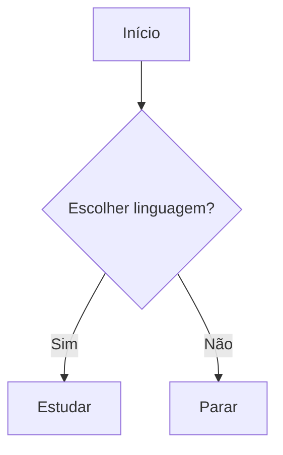

# 🖥 HTML dentro do Markdown

## 1. Texto colorido

Este texto é vermelho

Este texto é azul

---

## 2. Texto centralizado

<h2>Texto Centralizado</h2>

Este parágrafo está centralizado

---

## 3. Texto com tamanho personalizado

Texto grande (24px)

Texto pequeno (12px)

---

## 4. Linha horizontal personalizada

---

## 5. Listas com emoji (HTML + Markdown)
<ul>
<li>🚀 Lançamento</li>
<li>📚 Estudo</li>
<li>💻 Programação</li>
</ul>

---

## 6. Tabela com HTML
<table border="1" style="border-collapse:collapse;">
<tr>
<th>Nome</th>
<th>Idade</th>
<th>Cidade</th>
</tr>
<tr>
<td>João</td>
<td>30</td>
<td>São Paulo</td>
</tr>
<tr>
<td>Maria</td>
<td>25</td>
<td>Rio de Janeiro</td>
</tr>
</table>

---

## 7. Texto com destaque (background)
Este texto tem fundo vermelho

---

## 8. Imagem com tamanho ajustado

---

## 9. Caixa de alerta

⚠️ <b>Atenção:</b> Este é um alerta visual no Markdown!

---

## 10. Link com botão

<a href="https://google.com" style="background:#4CAF50;color:white;padding:10px 15px;text-decoration:none;border-radius:5px;">Ir para o Google</a>

## Importar sites

<iframe src="https://google.com" width="100%" height="500"></iframe>

Linha 1 Linha 2 Linha 3

